# LSK Core v1.0 Visual Workflows

This file provides visual workflow diagrams using Mermaid to illustrate LSK Core processes and conversation flows.

## **🚀 First-Time User Workflow**

```mermaid
graph TD
    A["👋 New to LSK Core?"] --> B{What do you want to do?}
    
    B -->|"Fix a bug"| C["🐛 Copy context.debug.template.yaml"]
    B -->|"Build something new"| D["📋 Copy context.pack.yaml"]
    B -->|"Optimize performance"| E["📊 Copy context.performance.template.yaml"]
    B -->|"Just explore"| F["📚 Read QUICK_START.md"]
    
    C --> G["✏️ Fill problem_statement & error_evidence"]
    D --> H["✏️ Fill objective & acceptance_criteria"]
    E --> I["✏️ Fill performance_data & target_metrics"]
    F --> J["🎯 Pick a simple first task"]
    
    G --> K["🤖 Paste to AI with debugging-conversation.recipe.md"]
    H --> L["🤖 Paste to AI with basic prompts"]
    I --> M["🤖 Paste to AI with performance focus"]
    J --> N["📋 Choose appropriate template"]
    
    K --> O["✅ Problem solved!"]
    L --> P["✅ Feature built!"]
    M --> Q["✅ Performance improved!"]
    N --> R["🔄 Continue with chosen path"]
    
    O --> S["📝 Try conversation.checkpoint.template.md"]
    P --> S
    Q --> S
    R --> S
    
    S --> T["🎉 You're now using LSK Core effectively!"]
    
    style A fill:#fff3e0
    style T fill:#e8f5e8
    style F fill:#e3f2fd
```

## Core LSK Core Pipeline

```mermaid
graph LR
    A["📋 Definition<br/>Define contracts & interfaces"] --> B["✅ Validation<br/>Create stubs & validate"] 
    B --> C["⚡ Implementation<br/>Build functionality"]
    C --> D["🔗 Integration<br/>Wire components together"]
    D --> E["👥 UAT<br/>User acceptance testing"] 
    E --> F["🎯 Certify<br/>Mark as complete"]
    
    style A fill:#fff3e0
    style B fill:#e3f2fd
    style C fill:#e8f5e8
    style D fill:#f3e5f5
    style E fill:#fff8e1
    style F fill:#e0f2f1
```

## AI Conversation Loop

## Context Pack Usage Flow

```mermaid
graph TD
    A["🎯 Identify Task Type"] --> B{Task Category}
    B -->|Performance| C["📊 Use context.performance.template.yaml"]
    B -->|Debugging| D["🐛 Use context.debug.template.yaml"]
    B -->|Integration| E["🔗 Use context.integration.template.yaml"]
    B -->|Refactoring| F["🔄 Use context.refactor.template.yaml"]
    B -->|General| G["📄 Use context.pack.yaml"]
    
    C --> H["✏️ Fill Template"]
    D --> H
    E --> H
    F --> H
    G --> H
    
    H --> I["🤖 Share with AI"]
    I --> J["💬 Structured Conversation"]
    J --> K["📝 Update Checkpoint"]
    K --> L{Task Complete?}
    L -->|No| M["🔄 Continue Conversation"]
    L -->|Yes| N["✅ Mark Phase Complete"]
    M --> I
    
    style A fill:#fff3e0
    style H fill:#e3f2fd
    style N fill:#e8f5e8
```

## Recipe-Based Conversation Flow

```mermaid
graph LR
    A["📚 Choose Recipe"] --> B{Recipe Type}
    B -->|🐛 Debug| C["Debug Recipe<br/>Problem → Analysis → Solution"]
    B -->|🏗️ Architecture| D["Architecture Recipe<br/>Context → Analysis → Options"]
    B -->|📋 Requirements| E["Requirements Recipe<br/>Discovery → Stories → Criteria"]
    B -->|✨ Feature| F["Feature Recipe<br/>Full LSK Core Pipeline"]
    B -->|🔄 Refactor| G["Refactor Recipe<br/>Issues → Patterns → Implementation"]
    
    C --> H["📝 Follow Recipe Steps"]
    D --> H
    E --> H
    F --> H
    G --> H
    
    H --> I["🤖 AI Conversation"]
    I --> J["📋 Recipe Checkpoints"]
    J --> K{Recipe Complete?}
    K -->|No| L["📍 Next Recipe Step"]
    K -->|Yes| M["✅ Document Outcome"]
    L --> I
    
    style A fill:#fff3e0
    style H fill:#e3f2fd
    style M fill:#e8f5e8
```

## Phase Progression Workflow

## Conversation Quality Improvement Loop

```mermaid
graph TD
    A["🎯 Start AI Conversation"] --> B["📤 Share Context"]
    B --> C["🤖 AI Response"]
    C --> D{Response Quality}
    D -->|Good| E["✅ Continue Conversation"]
    D -->|Poor| F["🔍 Identify Issue"]
    
    E --> G["📝 Update Conversation Checkpoint"]
    G --> H{Topic Complete?}
    H -->|No| I["🔄 Next Question/Topic"]
    H -->|Yes| J["📋 Conversation Summary"]
    I --> B
    
    F --> K{Issue Type}
    K -->|Missing Context| L["➕ Add Context to Pack"]
    K -->|Wrong Prompt| M["🔄 Try Different Prompt"]
    K -->|Unclear Question| N["❓ Rephrase Question"]
    K -->|Scope Too Broad| O["🎯 Break Down Topic"]
    
    L --> B
    M --> B
    N --> B
    O --> B
    
    J --> P["📚 Update Recipe/Template"]
    P --> Q["✅ Conversation Complete"]
    
    style A fill:#fff3e0
    style G fill:#e3f2fd
    style P fill:#f3e5f5
    style Q fill:#e8f5e8
```

## Multi-Phase Feature Development

## Context Evolution Through Phases

```mermaid
graph TD
    A["📋 Initial Context Pack"] --> B["Definition Phase"]
    B --> C["➕ Add Interface Specs"]
    C --> D["Validation Phase"]
    D --> E["➕ Add Stubs & Tests"]
    E --> F["Implementation Phase"]
    F --> G["➕ Add Code & Documentation"]
    G --> H["Integration Phase"]
    H --> I["➕ Add Integration Details"]
    I --> J["UAT Phase"]
    J --> K["➕ Add Test Results"]
    K --> L["Certification Phase"]
    L --> M["📚 Final Context Archive"]
    
    style A fill:#fff3e0
    style C fill:#e3f2fd
    style E fill:#e8f5e8
    style G fill:#f3e5f5
    style I fill:#fff8e1
    style K fill:#e0f2f1
    style M fill:#c8e6c9
```

## Usage Guidelines

### **Choosing the Right Workflow**

1. **New Feature**: Use full LSK Core Pipeline
2. **Bug Fix**: Start with Debugging Conversation Flow
3. **Architecture Changes**: Use Architecture Recipe Flow
4. **Requirements Unclear**: Use Requirements Recipe Flow
5. **Code Quality Issues**: Use Refactor Recipe Flow

### **Adapting Workflows**

- **Lenient Mode**: Skip phases with justification
- **Experimental Mode**: Use conversation flows without formal phases
- **Team Mode**: Multiple people can work different phases in parallel

### **Visual Workflow Benefits**

- **Clarity**: Shows decision points and flow
- **Onboarding**: Helps new team members understand process
- **Planning**: Visualizes dependencies and timelines
- **Communication**: Shared understanding of methodology