# LLM Operating Guide (Prompt-Only Workflow)

## Purpose
Use this guide to collaborate with an LLM using the LSKv4 templates to structure the dialogue and persist project state as plain-text artifacts.

## Roles
- User: sets goals, provides constraints, approves changes, curates context.
- LLM: proposes steps, drafts artifacts, follows contracts and rubrics, records outcomes.

## Core Artifacts
- `core/contracts/patterns.yaml, approaches.yaml, prompts.yaml, pipeline.yaml` — shared canon and process.
- `core/templates/phase.plan.yaml` — living phase plan (current/next, statuses).
- `core/templates/checkpoint.md` — per-phase checkpoint (summary, decisions, blockers, next steps, references).
- Context pack (see template) — task, constraints, key code/excerpts, diffs, glossary.
- Acceptance checklist — phase evaluation.

## Operating Loop

```mermaid
graph TD
    A["1️⃣ Align<br/>Read contracts & phase plan"] --> B["2️⃣ Propose<br/>LLM suggests next step"]
    B --> C["3️⃣ Execute<br/>Run prompt with context"]
    C --> D["4️⃣ Evaluate<br/>Run acceptance checklist"]
    D --> E{Pass?}
    E -->|Yes| F["5️⃣ Reference<br/>Update checkpoint & advance"]
    E -->|No| G["🔄 Iterate<br/>Adjust & retry"]
    G --> B
    F --> H{More work?}
    H -->|Yes| A
    H -->|No| I["✅ Phase Complete"]
    
    style A fill:#e3f2fd
    style I fill:#e8f5e8
    style E fill:#fff3e0
```

**Steps:**
1. **Align** - Read contracts and the current `phase.plan.yaml`. Confirm phase goal and exit criteria.
2. **Propose** - LLM proposes next concrete step + exact prompt to run. User approves or adjusts.
3. **Execute** - Run the prompt with the prepared context pack. Paste outputs into the active `checkpoint.md`.
4. **Evaluate** - Run acceptance checklist; record pass/fail and notes.
5. **Reference** - If pass: update `phase.plan.yaml` (mark complete, advance to next). If fail: iterate.

## Governance (optional, lightweight)
Use the optional `governance` block in `context.pack.yaml` to clarify:
- Context Spaces (e.g., lsk settings, user environment, project code, subject matter, telemetry, chat history)
- Context Hierarchy (topics/tags and relationships)
- Context Direction (start point, current state, key/pending decisions, target outcome, options, next steps)

## Session Resumption Checklist
- Current phase and status in `phase.plan.yaml` are accurate
- Last checkpoint file contains summary, decisions, blockers, next steps
- Links to deliverables and prior conversation present under References
- Context pack (and optional governance) updated for any new files/changes

## Tips
- Keep prompts and outputs concise; link large code via references/snippets
- Budget tokens: include only files/excerpts relevant to the current step
- Prefer stable interfaces and contracts; defer implementation detail when unclear

## Quick Run (copy/paste)
1) Prepare context (open context.pack.yaml)
- Paste from `context.pack.example.yaml` and adjust task, files, constraints

2) Choose a prompt
- For stack-agnostic: `service-gen-neutral-001` (prompts.yaml)
- For TS/React: use the TS variants

3) Ask the LLM (paste):
"Use the attached context pack. Run {prompt_id} to produce the service and a 10-line usage example. Keep changes minimal and idiomatic."

4) Record checkpoint
- Copy `checkpoint.md` → `checkpoint@example.md` and fill summary/decisions/next steps

5) Evaluate and advance
- Run `acceptance.checklist.md` (pass/fail)
- Update `phase.plan.yaml` (or start from `phase.plan.example.yaml`)
